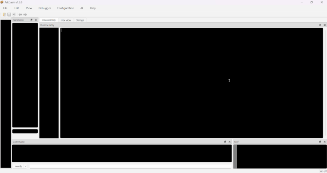

# arkDasm

Interactive disassembler for PE32+ executables and debugger for x64 Windows.

## Features

- x86-64 disassembly with auto-generated comments and labels
- Local debugger with breakpoints and memory snapshots
- MCP server — drive arkDasm from an AI assistant, over the Model Context Protocol
- Functions, imports, and exports listing
- Cross-reference viewer
- Rename symbols and add comments
- Code analysis and procedure detection
- Export disassembly to `.asm` file
- Embedded Python scripting console
- Support for conditional software breakpoints
- PDB debug symbol loading
- Customizable colors and fonts
- Bookmarks
- Hex view
- Save/load project database

## Keyboard shortcuts

### Disassembly window — Navigation

| Action | Shortcut |
|---|---|
| Jump to previous view | Esc |
| Jump to next view | \` |
| Goto address | g |
| Jump to entrypoint | Ctrl + e |
| Add bookmark | Alt + m |
| Show bookmarks | Ctrl + m |

### Disassembly window — Edit

| Action | Shortcut |
|---|---|
| Make code | c |
| Make data | d |
| Make procedure | p |
| Make byte array | Shift + 8 |
| Make ASCII string | a |
| Make UTF-16 string | w |
| Undefine | u |
| Rename | n |

### Disassembly window — Miscellaneous

| Action | Shortcut |
|---|---|
| Enter comment | ; |
| Show xref to address | x |

### Debugger

| Action | Shortcut |
|---|---|
| Start process | F9 |
| Go | F5 |
| Step Into | F11 |
| Step Over | F10 |
| Run until return | Shift + F11 |
| Pause execution | Shift + P |
| Terminate process | Shift + F5 |
| Insert or remove breakpoint | F2 |

### Application shortcut

| Action | Shortcut |
|---|---|
| Toggle hex code on/off | F6 |
| Focus command line | F1 |

## This software uses

- [Zydis](https://github.com/zyantific/zydis) 4.1.1 — x86/x86-64 disassembler library (MIT License)
- [Qt](https://www.qt.io/) 6 — cross-platform application framework (LGPL v3)

## License

Freeware. Closed source — only the compiled `.exe` is distributed.
